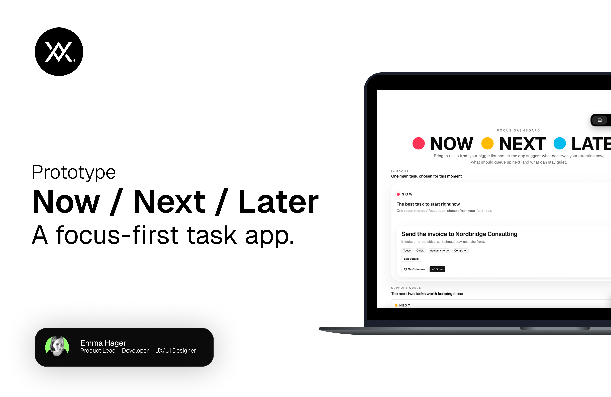

# Now / Next / Later

A focus-first task app for people who get overwhelmed by long lists and typical reminder or task managers. For many people, especially with ADHD (like myself), the hard part is not storing tasks. It is deciding what matters now when everything feels equally loud.

Typical reminder and task apps like Apple Reminders, Google Tasks, and Todoist are built around lists: lists of tasks, lists of lists, due dates, reminders, priorities, and notifications. Over time these systems grow into long backlogs of unfinished tasks and deadlines. Instead of reducing mental load, the app itself can start to feel like another thing you have to manage.

I have made this app particularly to help reduce the noise:

- `Now`: the one task worth focusing on right now
- `Next`: a short support queue
- `Not now`: everything else, kept out of the way but still safe

The goal is not to be a giant productivity system. It is to help answer one question quickly:

`What should I do right now?`

This project is designed around that problem:

- quick capture for notes, reminders, and messy thoughts
- brain-dump import that turns a rough list into separate tasks
- focus modes like `Pick for me`, `Quick wins`, `Low energy`, `15 minutes`, and `Deep work`
- a calmer main view where `Now` and `Next` stay in focus
- optional AI through Ollama, with a built-in fallback when AI is not available

Main goal is:
- clarity over feature overload
- reducing overwhelm
- making task choice easier
- building a more useful ADHD-friendly focus layer on top of ordinary task capture

⚠️ Note: This is a small product prototype built to explore a simple focus-first task model. It is not a production-ready app as of now.

## All features

- Focus dashboard with `Now`, `Next`, `Not now`, `Avoidance`, and `Done`
- Quick add
- Paste messy list import
- Editable task metadata:
  - `Today`, `Soon`, `Someday`
  - `Quick`, `Medium`, `Deep`
  - `Low energy`, `Medium energy`, `High energy`
  - `Anywhere`, `Computer`, `Home`, `Errands`, `Calls`
- Focus tools:
  - `Refocus`
  - `Morning triage`
  - `Avoidance check`
- English and Swedish UI
- Light and dark mode
- Local persistence with `localStorage`
- Optional Ollama integration for local or cloud-backed AI

## AI is optional

The app works without AI.

If no AI model is available, it falls back to built-in focus logic.

### Use without AI

You can use the app immediately with:

- quick add
- messy list import
- manual task editing
- built-in ranking and focus modes

No Ollama setup is required.

### Use with Ollama AI

This app can optionally use [Ollama](https://ollama.com/) for:

- smarter brain-dump cleanup
- natural-language refocus
- morning triage
- avoidance checks

You can use either:

- a downloaded local Ollama model
- a cloud model through Ollama, if your Ollama app is signed in

### Basic Ollama setup

1. Install Ollama from [ollama.com/download](https://ollama.com/download).
2. Open the app.
3. In this project, open `AI settings`.
4. Choose either `Use local model` or `Use cloud model`.
5. Follow the guided setup in the app.

### Example local model command

If Ollama is already installed, this is an example of a local model command:

```bash
ollama run gemma3:4b
```

That downloads the model locally if it is not already installed.

## Ollama support

Ollama support works differently depending on where the app runs:

- Local development on your own machine:
  local Ollama features can work if Ollama is installed and reachable.
- Public deployment:
  the app still works, but it will usually fall back to built-in logic until a self-hosted AI backend is implemented.
  
In other words:

- the app is fully usable without AI
- local Ollama is best for personal/local use
- public AI support needs extra backend work

## Tech stack

- [Next.js](https://nextjs.org/)
- [React](https://react.dev/)
- [Tailwind CSS](https://tailwindcss.com/)
- [next-themes](https://github.com/pacocoursey/next-themes)
- [Zod](https://zod.dev/)
- [Lucide](https://lucide.dev/)
